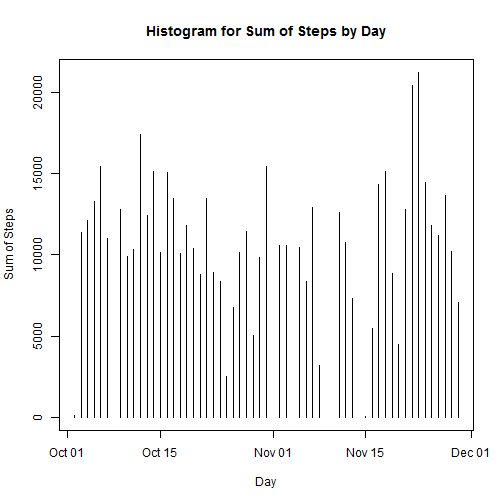

# Reproducible Research: Peer Assessment 1
### R Markdown File by PCommodore

The data for this assignment can be downloaded from the course web site:
Dataset: Activity monitoring data [52K]

The variables included in this dataset are:

* steps: Number of steps taking in a 5-minute interval (missing values are coded as NA)
* date: The date on which the measurement was taken in YYYY-MM-DD format
* interval: Identifier for the 5-minute interval in which measurement was taken
* The dataset is stored in a comma-separated-value (CSV) file and there are a total of 17,568 observations in this dataset.

## Step 1: Loading and preprocessing the data

This step consists of following:
* 1.1 Read in the file as a data frame
* 1.2 Convert date column into column of the Date class
* 1.3 Remove all rows with NA


```r
# 1.1
activity = read.csv("C:/Users/LenovoJ/Desktop/repos/RepData_PeerAssessment1/activity/activity.csv")
# 1.2
activity$date = as.Date(activity$date, "%Y-%m-%d")
# 1.3
activitycleaned = na.omit(activity)
```


```r
head(activity)
```

```
##   steps       date interval
## 1    NA 2012-10-01        0
## 2    NA 2012-10-01        5
## 3    NA 2012-10-01       10
## 4    NA 2012-10-01       15
## 5    NA 2012-10-01       20
## 6    NA 2012-10-01       25
```


## Step 2: What is mean total number of steps taken per day?

This step consists of the following:
* 2.1 Compute data frame presenting total number of steps by day
* 2.2 Plot histogram of total number of steps across day
* 2.3 Compute data frame presenting mean number of steps by day
* 2.4 Compute data frame presenting median number of steps by day


```r
library(reshape2)
library(lattice)
# 2.1
activitymelt = melt(activitycleaned, id = c("date"), measure.vars = c("steps"))
activitydcastsum = dcast(activitymelt, date ~ variable, sum)

# 2.2
plot(activitydcastsum$date, activitydcastsum$steps, type = "h", xlab = "Day", 
    ylab = "Sum of Steps", main = "Histogram for Sum of Steps by Day")
```

 

```r

# 2.3
activitydcastmean = dcast(activitymelt, date ~ variable, mean)
ameanbyday = activitydcastmean

# 2.4
activitymelt$value = as.double(activitymelt$value)
activitydcastmedian = dcast(activitymelt, date ~ variable, median)
amedianbyday = activitydcastmedian
```


```r
# Data frame for total number of steps by day
head(activitydcastsum)
```

```
##         date steps
## 1 2012-10-02   126
## 2 2012-10-03 11352
## 3 2012-10-04 12116
## 4 2012-10-05 13294
## 5 2012-10-06 15420
## 6 2012-10-07 11015
```

```r
# Data frame for mean number of steps by day
head(ameanbyday)
```

```
##         date   steps
## 1 2012-10-02  0.4375
## 2 2012-10-03 39.4167
## 3 2012-10-04 42.0694
## 4 2012-10-05 46.1597
## 5 2012-10-06 53.5417
## 6 2012-10-07 38.2465
```

```r
# Data frame for median number of steps by day
head(amedianbyday)
```

```
##         date steps
## 1 2012-10-02     0
## 2 2012-10-03     0
## 3 2012-10-04     0
## 4 2012-10-05     0
## 5 2012-10-06     0
## 6 2012-10-07     0
```


## Step 3: What is the average daily activity pattern?

This step consists of the following:
* 3.1 Time Series plot of the 5-minute interval (x-axis) and the average number of steps, averaged across all days over (y-axis)
* 3.2 State the interval which contains the maximum number of steps


```r
# 3.1
activitymeltinterval = melt(activitycleaned, id = c("interval"), measure.vars = c("steps"))
activitydcastintervalmean = dcast(activitymeltinterval, interval ~ variable, 
    mean)
ameanbyinterval = activitydcastintervalmean

# Plot Time Series
plot(ameanbyinterval$interval, ameanbyinterval$steps, type = "l", xlab = "Interval", 
    ylab = "Average Number of Steps", main = "Time Series Plot Mean Steps across Intervals")
```

 

```r

# 3.2 The maximum number of steps occur at interval 0835-0840
ameanbyinterval[ameanbyinterval$steps == max(ameanbyinterval$steps), ]
```

```
##     interval steps
## 104      835 206.2
```


## Step 4: Imputing missing values

This step consists of the following:
* 4.1 Find the number of rows with NA
* 4.2 Fill in missing values with the mean number of steps for the respective intervals
* 4.3 Compute new data frame with the missing values filled in
* 4.4 Make a histogram of the total number of steps taken each day and Calculate and report the mean and median total number of steps taken per day.


```r
# 4.1
numbermissing = nrow(activity) - nrow(activitycleaned)
numbermissing
```

```
## [1] 2304
```

```r

# 4.2
for (i in 1:nrow(activity)) {
    if (is.na(activity$steps[i])) {
        activity$filledsteps[i] = ameanbyinterval[ameanbyinterval$interval == 
            activity$interval[i], ][1, 2]
    } else {
        activity$filledsteps[i] = activity$steps[i]
    }
}


# 4.3
newdata = activity
newdata$steps = newdata$filledsteps
newdata = newdata[, 1:3]


# 4.4
newdatamelt = melt(newdata, id = c("date"), measure.vars = c("steps"))
newdatadcastsum = dcast(newdatamelt, date ~ variable, sum)

# Plot histogram for Sum of Steps per day
plot(newdatadcastsum$date, newdatadcastsum$steps, type = "h", xlab = "Day", 
    ylab = "Sum of Steps", main = "Histogram for Sum of Steps by Day (Missing Values Filled)")
```

 

```r

# Data frame for mMean steps per day
newdatadcastmean = dcast(newdatamelt, date ~ variable, mean)
newmeanbyday = newdatadcastmean

# Data frame for median steps per day
newdatamelt$value = as.double(newdatamelt$value)
newdatadcastmedian = dcast(newdatamelt, date ~ variable, median)
newmedianbyday = newdatadcastmedian
```


## Step 5: Are there differences in activity patterns between weekdays and weekends?

This step consists of the following:

* 5.1 Create new factor 'weekday' and 'weekend'
* 5.2 Make a panel plot containing a time series plot (i.e. type = "l") of the 5-minute interval (x-axis) and the average number of steps taken, averaged across all weekday days or weekend days (y-axis). 


```r
# 5.1
newdata$day = weekdays(newdata$date)
newdata$weekday = newdata$day

for (i in 1:nrow(newdata)) {
    if (newdata$day[i] == "Saturday" | newdata$day[i] == "Sunday") {
        newdata$weekday[i] = "weekend"
    } else {
        newdata$weekday[i] = "weekday"
    }
}

weekdaydata = newdata[newdata$weekday == "weekday", ]
weekenddata = newdata[newdata$weekday == "weekend", ]

weekdaymeltinterval = melt(weekdaydata, id = c("interval"), measure.vars = c("steps"))
weekdaydcastintervalmean = dcast(weekdaymeltinterval, interval ~ variable, mean)
weekdaymeanbyinterval = weekdaydcastintervalmean
# plot(weekdaymeanbyinterval$interval,weekdaymeanbyinterval$steps,type='l')

weekendmeltinterval = melt(weekenddata, id = c("interval"), measure.vars = c("steps"))
weekenddcastintervalmean = dcast(weekendmeltinterval, interval ~ variable, mean)
weekendmeanbyinterval = weekenddcastintervalmean
# plot(weekendmeanbyinterval$interval,weekendmeanbyinterval$steps,type='l')

weekdaylabel = rep("weekday", nrow(weekdaymeanbyinterval))
weekdaymeanbyinterval$label = weekdaylabel

weekendlabel = rep("weekend", nrow(weekendmeanbyinterval))
weekendmeanbyinterval$label = weekendlabel

weekdaynweekend = rbind(weekdaymeanbyinterval, weekendmeanbyinterval)

# 5.2
attach(weekdaynweekend)
xyplot(steps ~ interval | label, main = "Time Series Panel Plot by Weekday/Weekend", 
    xlab = "Interval", ylab = "Steps", type = "l", layout = c(1, 2))
```

 


### End of File
